Deploying my Jamstack Docusaurus portfolio and blog with Terraform and Github Workflows.

<!--truncate-->

:::info
This is less of a tutorial and more of a high-level overview of my experience creating and deploying this blog. A tutorial on setting up your own will be available soon!
:::

## Background

I've never really liked life stories inserted at the beginning of technical articles for search engine optimization, so I'll try and keep this part short.

I've been meaning to spin up a combination portfolio and blog for a while now. Part of the reason I haven't is probably time. I've been quite busy traveling for the holidays, working on personal projects, and so on. Typical life stuff.

The biggest reason I haven't deployed a portfolio and blog is simply that I haven't prioritized my brand until recently. I guess I didn't feel like I had anything new to contribute to the world of software. However, I've recently concluded that you don't always have to contribute new things. Oftentimes, people are just looking for a way to combine existing things. This is where I believe I have something interesting to share.

I have spent the last two months developing what I consider a scalable, repeatable, and secure framework for managing infrastructure using Packer, Terraform, Ansible, and GitHub Workflows. It is not for personal use, although it could be. What my framework is—in my opinion—is a solution to the scaling problem that enterprises face when undergoing a cloud migration. It tackles concepts in security, separation of concerns, developer self-service, and more.

I'm not ready to show my framework to the world, yet! That being said, I can accomplish two things with this blog.

1. This blog **will** be the location of the future blog posts of my framework.
2. This blog serves as an example of one particular use case of my framework: continuous deployment of Jamstack sites using Terraform and GitHub Workflows.

I guess I didn't keep this section short. Let's get started!

## What I Built

Before I get into the details of how this blog is deployed, let me just lay out the entire stack for those who may be looking to do something similar.

This blog is a [Docusaurus](https://docusaurus.io/) site deployed to a [Google Cloud Storage](https://cloud.google.com/storage) bucket on [Google Cloud Platform](https://cloud.google.com/). The Docusaurus instance lives in a GitHub repository and is deployed via a GitHub Workflow that includes a Terraform step, a Yarn build step, and a Google Cloud Storage bucket file upload step.

### Why Docusaurus?

Before I deployed this blog, I explored a few different options. For example, I started with a no-code solution using [Notion](https://www.notion.so/product) [public pages](https://www.notion.so/help/public-pages-and-web-publishing). It was quick and easy, but it left much to be desired in terms of customization and simple blog stuff like the ability to use my [https://piper.codes](https://piper.codes) domain name.

I also tried

- [MkDocs](https://www.mkdocs.org/)
- [Confluence](https://www.atlassian.com/software/confluence)

I even tried just building my own [Next.js](https://nextjs.org/) application. This probably would have worked, if I had enough time to spend writing a portfolio and blog application from scratch.

I settled on Docusaurus because of two things.

1. It's a great-looking Jamstack framework based on React that supports Markdown-based documentation and blog entries.
2. It seems to have prioritized [search engine optimization](https://docusaurus.io/docs/seo) in a manner that none of the previous options have.

That's not to say there isn't a better option, but Docusaurus works for me.

:::info
Docusaurus has a great [comparison of alternative frameworks](https://docusaurus.io/docs#comparison-with-other-tools).
:::

### Why Google Cloud Platform?

Another question I'm anticipating is why I would use Google Cloud Platform, especially when there are many platform-as-a-service (PaaS) offerings, like Vercel or Heroku, that support continuous deployment. Sometimes, right out of a GitHub repository.

I suppose I'm biased in a way. I am a Cloud Engineer, and I generally prefer working directly with the cloud platform as opposed to using services of a PaaS (that may themselves be hosted on a cloud platform). I'll acknowledge that.

Part of the reason I went with Google Cloud Platform is that, as I mentioned above, I'm working on a framework for Terraform scalability _on Google Cloud Platform_. I chose Google Cloud Platform for this blog because I can apply part of what I've already developed to its deployment process.

It's also due to cost. Docusaurus is a Jamstack application, which means it can be built into a series of static pages. Static pages fit naturally within Google's Cloud Storage and CDN products. At small scales, PaaS services like Vercel offer advantageous fully-free pricing models for non-commercial use. At higher volumes, however, the scale usually tips in the favor of the do-it-yourself cloud platforms. Unless you can negotiate special pricing with those PaaS providers, of course.

I'm interested to see how much Google Cloud Platform costs in practice, as pricing is highly dependent on a whole bunch of hard to estimate metrics.

## How I Built It

I'll describe the overall process of deploying this blog here. You can follow it if you're interested in setting up your own.

:::info
You can check out [the repository](https://github.com/doughepi/portfolio) if you'd like to replicate it or follow along.
:::

### Buy Domain

I usually use [Google Domains](https://domains.google.com) for my domain name needs.

I knew that if I wanted my blog to be interesting and easily searchable, I needed a nice domain name. I figured my name would be short and recognizable enough, so I looked for an interesting top-level domain.

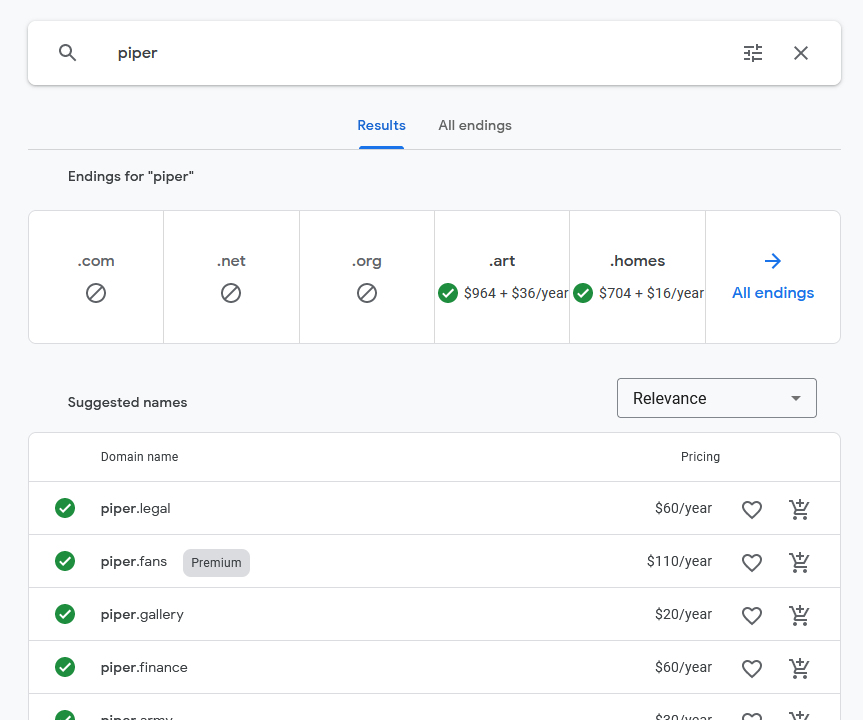

I eventually settled on [https://piper.codes](https://piper.codes). I didn't realize `codes` was a valid top-level domain, but I think it suits a blog and portfolio website quite well!

### Build Docusaurus

The Docusaurus instance is pretty plain. I didn't end up configuring much, just adjusting some of the configuration options.

I followed the [installation instructions](https://docusaurus.io/docs/installation) on Docusaurus' website. I ended up with a repository like this.

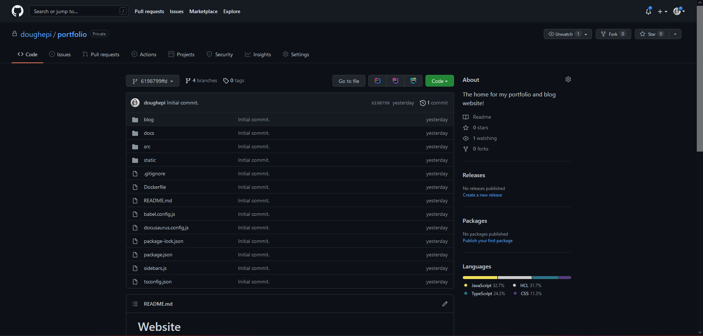

### Add Terraform

This is, in my opinion, the first half of the "special sauce" that allows for this blog to be deployed.

If you're not familiar with Terraform, it's a descriptive language for defining infrastructure. If I write something like

```tf
resource "google_storage_bucket" "my_bucket" {
  name          = "unique-bucket-name-09342"
  location      = "US"
}
```

and I use the Terraform CLI to apply this change

```bash
terraform apply .
```

I'm going to get a bucket for my project.

:::info
I skipped over the authentication, the configuration of the Google Cloud Platform Terraform provider, and some other things. This was just a tiny example.
:::

I need to use Terraform to define a few resources for this blog.

- A Google Cloud Storage Bucket.
- A Google Cloud IAM policy to allow all unauthenticated users access to the bucket.
- A Google Cloud HTTP(S) load balancer.
- A Google Cloud DNS zone.
- An `A` record to give my load balancer a domain name.

Docusaurus blogs compile to static pages, and Google Cloud supports serving static pages from a Google Cloud Storage Bucket fronted with a load balancer. This is likely to be the cheapest possible option. I could have also deployed my Docusaurus instance as a serverless container on Google Cloud Run, but then I would be paying for a few extra things.

- The stored Docker image.
- The on-demand CPU time when the Cloud Run instance is receiving requests.

I'm not _totally_ minimizing my costs. I chose to use a multi-region bucket instead of a single region. I also configured Google Cloud CDN to allow my static content to be cached at Google's points of presence. This probably isn't necessary at my scale, but I thought it would be cool to try out. I suppose if you're doing this yourself, you can choose what you want to be enabled.

I put the Terraform in an `infrastructure/` folder in the root of my [blog's repository](https://github.com/doughepi/portfolio/tree/main/infrastructure).

I also had to create a few things manually.

- The Google Cloud Platform project.
- A Google Cloud Storage Bucket mean to store [Terraform state](https://www.terraform.io/docs/language/state/index.html).

### Add GitHub Workflows

The other half of the "special sauce" of this blog's deployment is the GitHub Workflows built to manage the deployment tasks. There are two.

On pull request to the `main` branch.

1. Check the Terraform formatting.
2. Validate the Terraform.
3. Run the Terraform `plan` command to print out what will change with the Terraform `apply` command is run.

On the completion of the pull request and merge to `main`.

1. Compile of the Docusaurus instance into static resources.
2. Deploy the Terraform to create the infrastructure.
3. Upload static resources to the Google Cloud Storage bucket.

I put these workflows in the special `.github/workflows` folder of my [blog's repository](https://github.com/doughepi/portfolio/tree/main/.github/workflows).

I also had to do one last thing manually.

What allows all this to work is a Google Cloud Platform Service Account. More specifically, a Service Account key was inserted into the secrets of my GitHub repository.

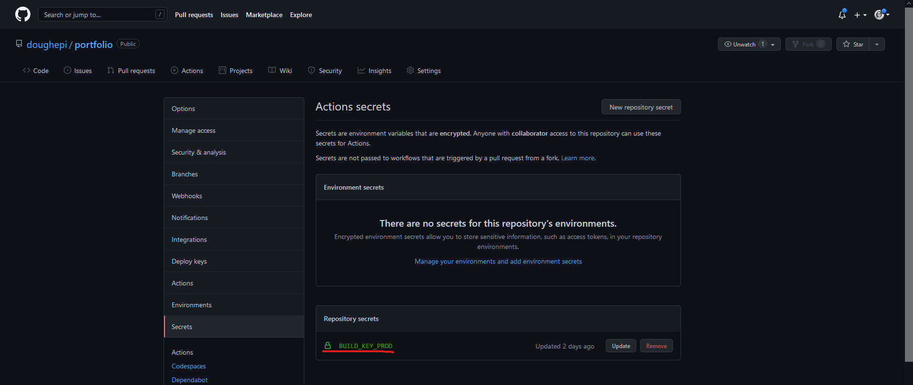

I generated this manually by creating a Service Account in the Google Cloud Console and creating a key for that Service Account.

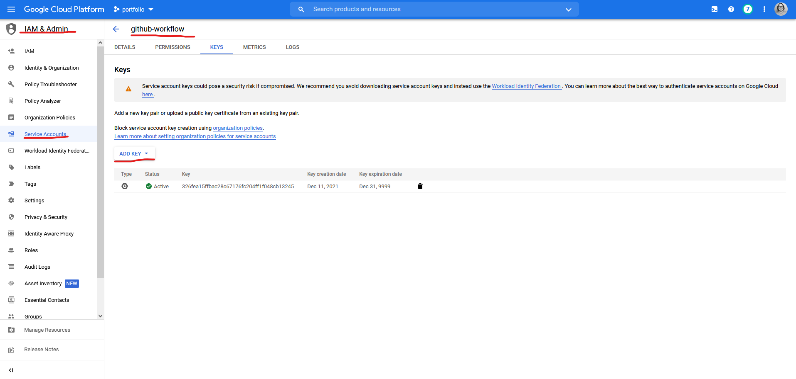

Once the key is set on the GitHub repository, I can use the `google-GitHub-actions/setup-gcloud` action within the Github Workflow to activate the Service Account.

```yml title='on-pr-prod.yml'

---
- name: Set up Cloud SDK
  uses: google-github-actions/setup-gcloud@master
  with:
    project_id: ${{ env.PROJECT_ID }}
    service_account_key: ${{ secrets.BUILD_KEY_PROD }}
    export_default_credentials: true
```

This logs in as the Service Account and puts the key in a known location. Other services and command-line utilities can access that location to authenticate with Google as that Service Account. This is known as [`application-default` credential](https://cloud.google.com/docs/authentication/production) authentication. Terraform will use this method to authenticate with Google Cloud Platform.

This action also configures the `gcloud` command-line interface, which is used in the last part of the deployment GitHub Workflow to upload the compiled Docusaurus static resources with `gsutil`.

### Triggering Deployment

Putting it all together now, this is what a typical deployment looks like.

First I make the desired changes on a new branch of my repository. When I'm finished, I commit them and push them to GitHub.

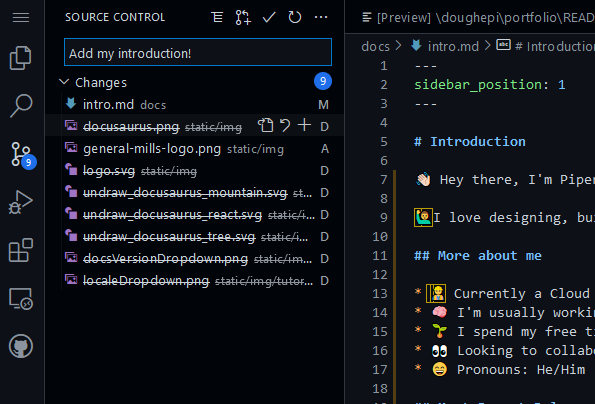

Then I create a pull request.

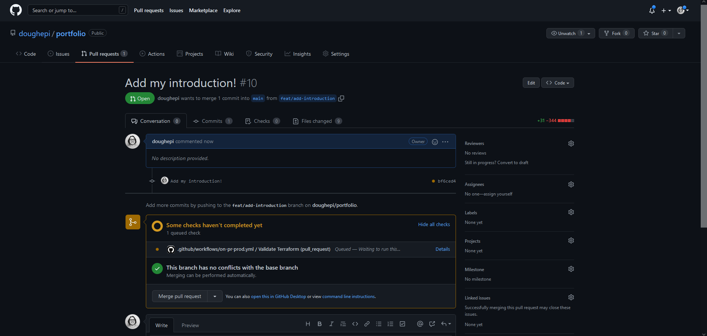

When the pull request is created, the pull request checks begin. There is only one. This is the "on pull request" workflow that I mentioned earlier.

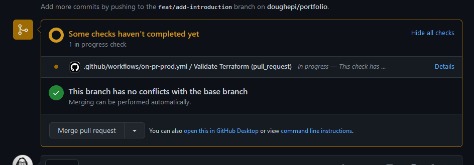

This check is running the Terraform `fmt` step, `validate` step, and the Terraform `plan` step I mentioned earlier.

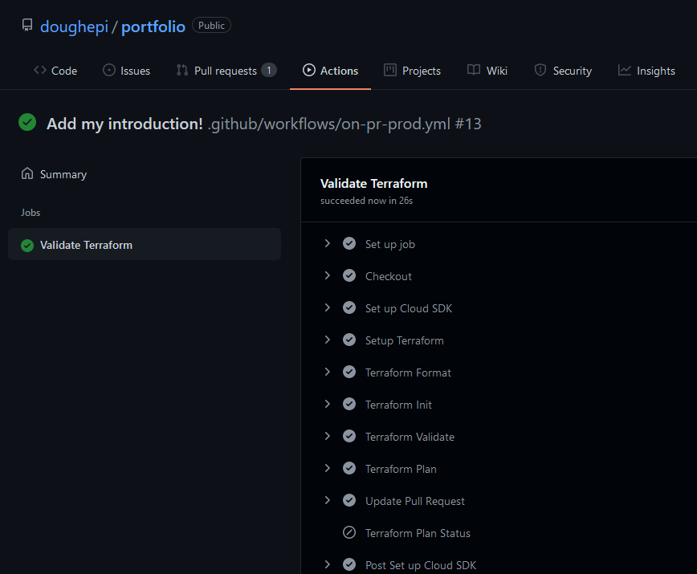

I like to pay special attention to the Terraform `plan` step to make sure that no infrastructure is being destroyed when It shouldn't be.

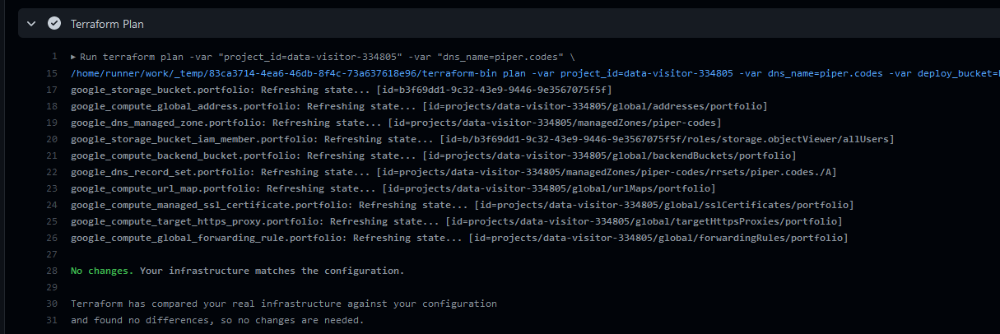

Since no infrastructure is being destroyed, and the Workflow completes successfully, I can go ahead and merge the pull request.

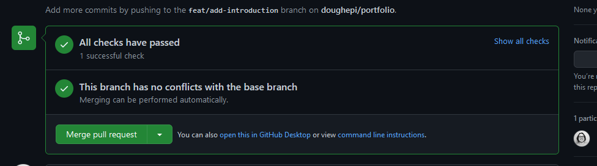

At this point, the changes are merged to the `main` branch and the second Workflow kicks off.

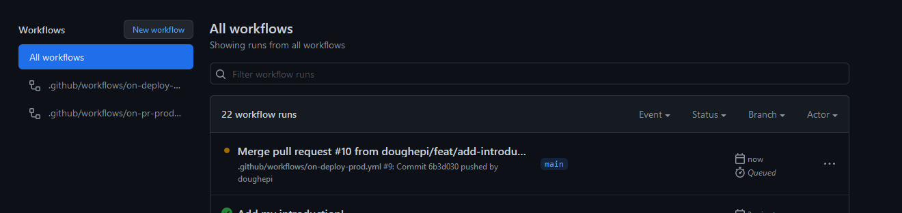

This workflow does a bit more since it's running a Terraform `apply`, building the website, and uploading the built static resources for my Docusaurus instance.

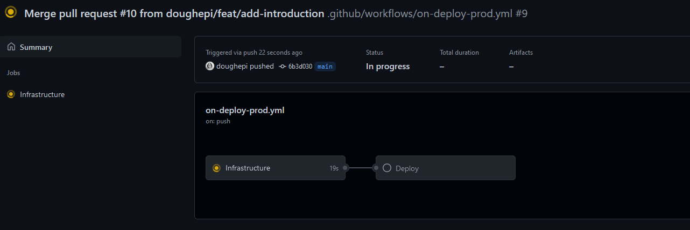

The website compilation and upload both happen in the "deploy" job. I'll skip the infrastructure step since we already know from the Terraform `plan` that nothing is changing.

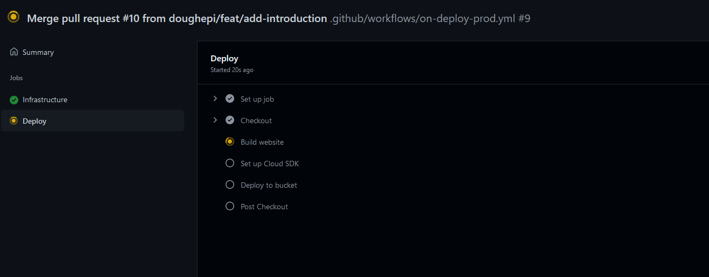

The website is built.

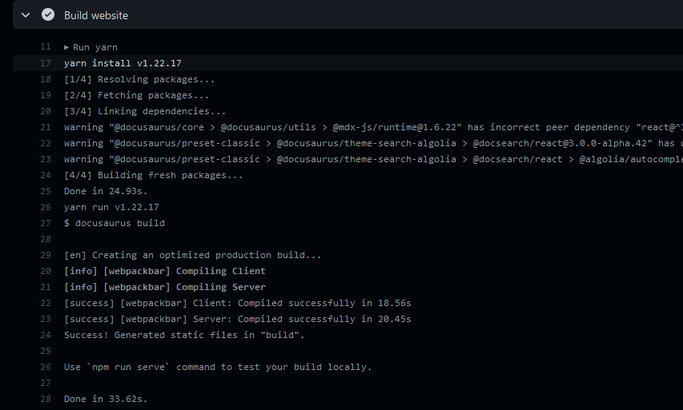

And then it is uploaded.

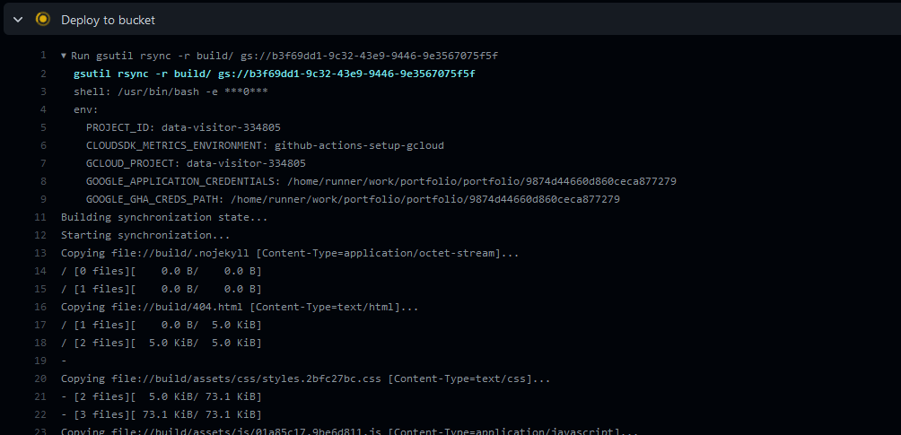

At this point, our website is built and uploaded to the bucket. It should be available to the public! Let's check out the published page.

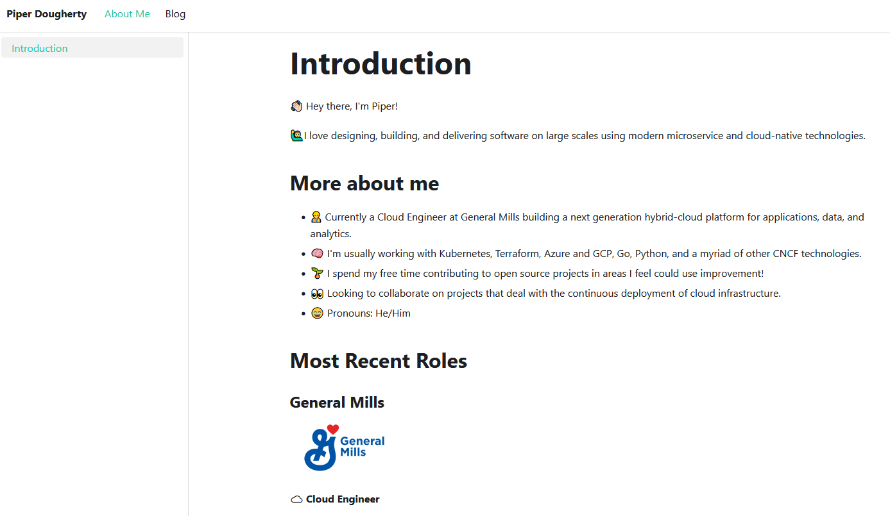

It looks good!

## Conclusion

This is probably more work than is necessary for a simple portfolio and blog, but I'm happy with the results. Docusaurus provides a flexible and maintainable structure for documentation and blog entries, and that's all I need.

I learned quite a bit, actually, during the initial setup of this blog. More than I expected. It seems that even if you feel you fully understand something, there's always a microscopic area of concern that has limitless potential for configuration or tuning. For example, I didn't realize that Google Cloud Storage has a CDN built-in. I had to learn more about the reasoning behind manually enabling the Google Cloud CDN on the load balancer. It turns out that Google Cloud Storage and Google Cloud Load Balancing share the same CDN, but you have to enable the Google Cloud CDN on the load balancer manually if you want to control cache parameters. Also, the Terraform I wrote defines a "classic" HTTP(S) load balancer? That must be new. I didn't do anything special and a load balancer I defined for a personal project a week ago wasn't considered classic. Oh well. More to learn.

Taking a step back, this blog represents something bigger.

Like I said in the introduction, the purpose of this blog, deployment model, all of the above, is twofold.

This is the blog I will use for all personal branding and knowledge sharing.

This blog also represents a small taste of something I have been working on: my scalable model for continuously deploying infrastructure. This blog is one specific use case for that model, and I'm excited for what's to come. Models and examples I intend to describe in my full release include

- continuous deployment of static resources to Google Cloud Storage (like this blog's deployment model)
- continuous deployment of serverless instances to Google Cloud Platform
- continuous deployment Google Compute Engine Unmanaged Instance Groups
- continuous deployment of Google Compute Engine Managed Instance Groups

and some others.

I'm excited about what's to come, and I hope that you are too! Feel free to contact me at my email [doughertypiper@gmail.com](mailto:doughertypiper@gmail.com) if you have any questions. I'm always available.

Thanks for reading!
